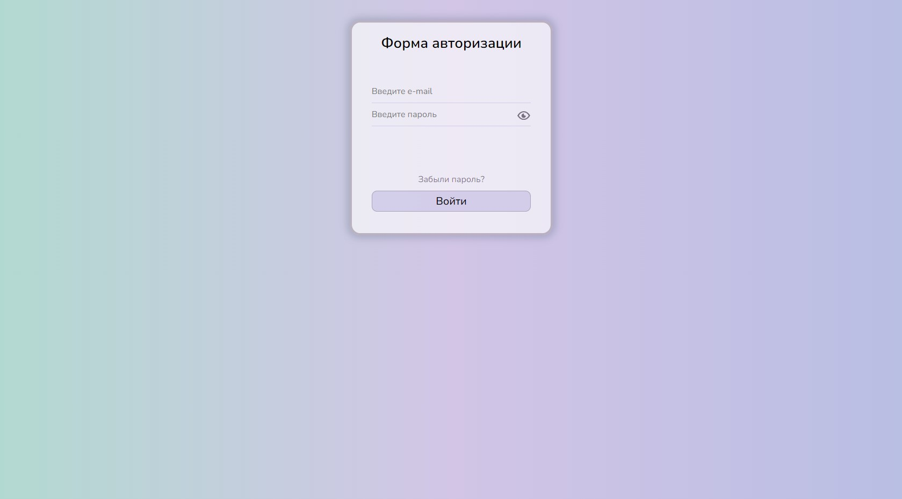

# 
Authentication form

## Тестовые email и пароль:

Email: test@ya.ru

Пароль: test

## Description

This is basic Authentication Form created with Typescript, React Hooks and React Hook Form. It validates e-mail and password and displays errors.  It is also possibly to show/hide password.

***
Форма аутентификации на базе Typescript, React Hooks и React Hook Form. Проверяет корректность электронной почты, пароля и отображает ошибки. Есть возможность скрыть/показать пароль.
